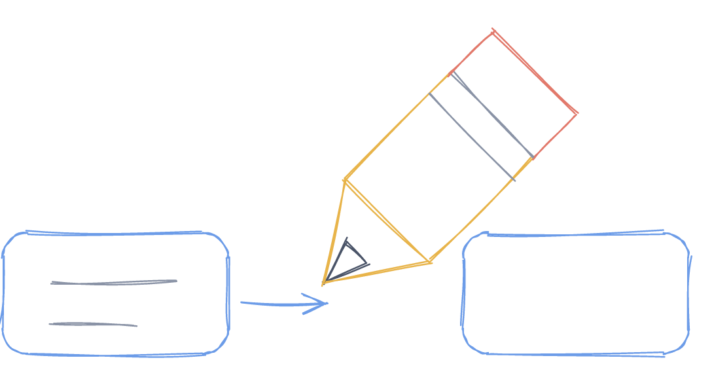
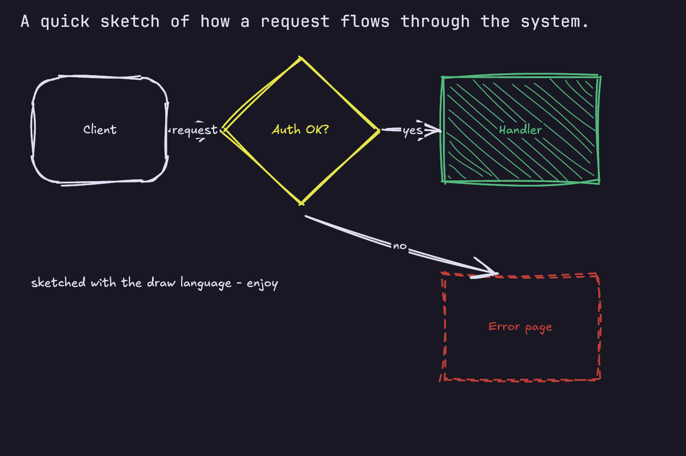

<div align="center">



# notopod

**Notes in your terminal, formatted while you type.**<br>
**Diagrams drawn by hand, with the keyboard.**

[](https://github.com/Yuvraj-cyborg/notopod/actions/workflows/ci.yml)
[](https://github.com/Yuvraj-cyborg/notopod/releases)
[](LICENSE)

</div>



That is an ordinary `.md` file. The diagram is a fenced code block, and
notopod paints it as a real picture at your terminal's pixel resolution —
press Ctrl+D and you can redraw it with single keys without leaving the note.

## What it is

A Markdown editor for the terminal. One binary, no runtime, about 2 MB.

- **Formatted as you write.** Headings, lists, tables and tasks render in
  place. The block your cursor is in shows its raw Markdown and snaps back
  when you leave it. Nothing is hidden or rewritten: the file on disk is
  what you typed, byte for byte.
- **Drawings, not character art.** A ` ```draw ` block is a real picture —
  strokes that wobble like a quick pen sketch, hatched fills, labels in
  Excalifont — painted over the cells the block occupies. Terminals without
  the kitty graphics protocol get the same shapes in braille dots.
- **A folder, not a file.** Tabs, a file panel, `[[links]]` you can follow,
  and a graph of how your notes connect.
- **Yours to keep.** Plain `.md` files, and a drawing is a short, readable
  code block in any other editor.
- **Nine themes**, a small config file, and vim keys when you want them.

## Install

```sh
curl -fsSL https://raw.githubusercontent.com/Yuvraj-cyborg/notopod/main/install.sh | sh
```

That takes the right binary for your machine from the latest release,
checks it against the sha256 published beside it, and puts it in
`~/.local/bin`. Nothing else on your system is touched. To choose where it
goes, or to pin a version:

```sh
curl -fsSL https://raw.githubusercontent.com/Yuvraj-cyborg/notopod/main/install.sh \
  | sh -s -- --to /usr/local/bin --version v0.3.0
```

If you would rather not pipe the internet into a shell — fair — the script
is [right here](install.sh) to read first, the
[releases page](https://github.com/Yuvraj-cyborg/notopod/releases) has the
archives for Linux, macOS and Windows, and there is always:

```sh
cargo install --git https://github.com/Yuvraj-cyborg/notopod   # needs Rust 1.88+
nix run github:Yuvraj-cyborg/notopod                           # try it without installing
```

Inside a clone, `cargo install --path .` installs your working copy — run
it again after pulling, since an install is a snapshot and not a link.

## Use

```
notopod ~/notes             a folder: the file panel opens on it
notopod notes.md            one note (created on first save if it is new)
notopod ~/notes plan.md     both: the folder on the left, the note open
notopod                     an empty note; it asks for a name when you save
```

The folder you name is where the panel and the graph stay for the rest of
the session, however far you wander from it.

```
notopod render notes.md     print a note formatted, then exit
notopod graph [DIR]         the notes in a folder and the links between them
notopod themes              try themes on a sample note and keep one
notopod config              where the config file and your themes live
```

`render` is made for pipes — `notopod render todo.md | less -R` — and drops
colour by itself when it is not writing to a terminal. `--theme nord`,
`--vim` and `--graphics braille` apply to a single run.

## Keys

Ctrl+S saves, Ctrl+Q quits, Ctrl+F finds, Ctrl+Z undoes. The ones worth
learning:

| | |
|---|---|
| **Ctrl+D** | Draw: edit the drawing under the cursor, or start one here |
| **Ctrl+B** | The file panel |
| **Ctrl+K** | The graph of your notes |
| **Ctrl+]** | Follow the link under the cursor |
| **Ctrl+T** / **Ctrl+W** | New tab / close this tab (Ctrl+PageUp and Ctrl+PageDown switch) |
| **Ctrl+P** | Turn the preview off, to see plain Markdown |

<details>
<summary>Every key</summary>

| Key | What it does |
|---|---|
| Arrows | Move. Up and Down step through wrapped lines and formatted blocks |
| Ctrl+Left / Ctrl+Right | Move by word (Alt too) |
| Home / End | Start / end of the line (Ctrl+A / Ctrl+E too) |
| Ctrl+Home / Ctrl+End | Start / end of the note |
| Enter | New line. On a list item it continues the list; on an empty one it ends it |
| Tab / Shift+Tab | Indent / outdent by two spaces |
| Ctrl+Z / Ctrl+Y | Undo / redo |
| Ctrl+S | Save |
| Ctrl+F / Ctrl+G | Find as you type / next match |
| Ctrl+O | Open a note by name, in a new tab |
| Ctrl+Q | Quit, asking first if anything is unsaved |

In the file panel:

| Key | What it does |
|---|---|
| ↑ ↓ or `j` `k` | Move |
| Enter | Open a note, or fold a directory open and shut |
| → ← or `l` `h` | Step into a directory, step back out |
| `r` | Read the disk again |
| `g` | The graph |
| Esc | Back to the note, panel still open |
| Ctrl+B | Put the panel away |

Only the directories you unfold are read, so a panel over a big tree costs
nothing. The drawing keys are in [docs/DRAWING.md](docs/DRAWING.md).

</details>

## How it looks while you type

A note is a list of blocks, and every one is drawn formatted except the
block holding your cursor, which stays exactly as you typed it:

```
What you typed          What you see, with the cursor on the second line

# Shopping              # Shopping         formatted
- [ ] milk              - [ ] milk         raw, because you are editing it
- [x] bread             ☑ bread            formatted
```

It is ordinary Markdown throughout: headings, emphasis, code, bullets,
numbers, tasks, quotes, pipe tables, rules, links, and front matter at the
top of the file.

## Drawings

A block tagged `draw` is a picture. Six lines of it:

    ```draw
    rect 1,1 14x5 "Parser" round
    ellipse 24,0 16x7 "Renderer" fill color=green
    diamond 46,1 14x7 "ok?" color=yellow
    line 8,3 -> 30,3 "AST"
    line 32,3 -> 52,4 dashed
    text 1,9 "hand-drawn, in your terminal" color=muted
    ```


**Ctrl+D** turns the block into a canvas: `r` rectangle, `e` ellipse, `d`
diamond, `l` line, `a` arrow, `t` label, `m` move, `x` delete. Every key
rewrites the block's text, so the file always matches the picture. The
language and the rest of the keys are in
[docs/DRAWING.md](docs/DRAWING.md) — this project's logo is one of these
blocks.

## Links and the graph

Notes link the way Obsidian's do: `[[Plan]]` finds `Plan.md` anywhere under
the folder, `[[Plan|the plan]]` shows other words, and a plain
`[text](other.md)` works too. **Ctrl+]** follows the link under your
cursor, and a `[[name]]` with no note behind it yet becomes a new note — so
you can write the link first and the note after.

**Ctrl+K** draws the whole folder: every note an ellipse labelled with its
heading, every link an arrow, busy notes filled and coloured, lonely ones
dashed. Arrows move between them, Tab walks them in order, Enter opens one.
`notopod graph` prints the same picture without the editor.

## Themes and config

`notopod themes` is a picker: the themes on the left, a sample note on the
right in whichever one is highlighted, drawings and all. Enter keeps your
choice, and saving it leaves the rest of your config file alone, comments
included.

```toml
# ~/.config/notopod/config.toml
theme = "nord"       # or mono, catppuccin-mocha, gruvbox-dark, dracula, ...

[canvas]
roughness = 0.7      # 0.0 exact geometry, 1.0 very sketchy

[graphics]
mode = "auto"        # auto | kitty | braille

[keys]
vim = false
```

`default` borrows your terminal's own colours, so notopod looks like the
rest of your setup. For a theme of your own, start from a built-in one:
`notopod themes nord > ~/.config/notopod/themes/mine.toml`.

## Vim keys

`[keys] vim = true`, or `--vim` for a single run. Normal and insert mode,
motions with counts, `d y c` over them and doubled for lines, `p P u
Ctrl+R >> <<`, `/ n N` to search, `gt gT` for tabs, `gf` to follow a link,
`ZZ` to save and quit, and a `:` line that knows `w q wq e bn bp tabnew
files graph draw theme` and line numbers. The Ctrl keys above keep working
in both modes, so turning this on takes nothing away. No visual mode yet,
because there is no selection yet.

## Not there yet

Selecting text (and with it vim's visual mode), ` ```mermaid ` blocks,
search across notes, syntax colours inside code blocks, Sixel and iTerm2
pictures, export to PNG or SVG.

## The code

One Cargo workspace: the `notopod` binary at the root and library crates
under `lib/` — `syntax` parses, `canvas` draws, `graphics` puts pictures on
the terminal, `render` styles and wraps, `theme` colours, `editor` holds
the text, `notes` finds the links, `tui` runs the screen.
[docs/ARCHITECTURE.md](docs/ARCHITECTURE.md) explains how they fit
together, and [CONTRIBUTING.md](CONTRIBUTING.md) has the checks and the
branch rules — work happens on `dev`, and `main` only receives releases.

MIT. See [LICENSE](LICENSE).
