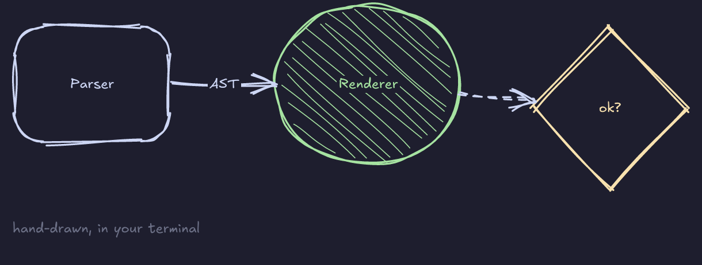

# notopod

Notes in your terminal, formatted while you type. Diagrams drawn by
hand, with the keyboard.


That is notopod running in a terminal. The diagram is a fenced code block
in an ordinary `.md` file, painted as a real picture at the terminal's
pixel resolution.

## What it is

A Markdown editor for the terminal, in one binary with no runtime.

- **Live preview, block by block.** Headings, lists, tasks, tables and
  quotes are shown formatted while you write. The one block your cursor
  is in shows its raw Markdown; leave it and it snaps back. Nothing is
  hidden or rewritten, so the file on disk is what you typed, byte for byte.
- **Drawings that are pictures, not character art.** A ` ```draw ` block
  is a sketch: strokes that wobble and overshoot like a quick pen drawing,
  hatched fills, and labels in Excalifont, the typeface Excalidraw uses.
  Terminals that speak the kitty graphics protocol show the picture;
  everywhere else gets the same shapes as braille dot art.
- **A drawing mode.** Press Ctrl+D and place boxes, arrows and labels with
  single keys — no coordinates to type. Every action rewrites the block's
  text, so the file always matches the picture.
- **Plain files.** A drawing is a short, readable code block in any other
  editor, and your notes are `.md` all the way down.
- **Nine themes**, or your own in a TOML file. `default` borrows your
  terminal's colours, so notopod looks like the rest of your setup.

## Install

**From source** — needs Rust 1.88 or newer.

```
cargo install --git https://github.com/Yuvraj-cyborg/notopod
```

In a clone, `cargo install --path .` does the same from your working
copy. Either way the `notopod` binary lands in `~/.cargo/bin`, which
`rustup` already put on your `PATH`. Run the command again after pulling
to update it — an install is a snapshot, not a link — and
`cargo uninstall notopod` removes it.

**With Nix**

```
nix run github:Yuvraj-cyborg/notopod              # try it without installing
nix profile install github:Yuvraj-cyborg/notopod  # install
nix develop                                       # in a clone: a Rust shell
```

**Prebuilt binaries** — every release ships Linux, macOS and Windows
archives on the Releases page. Unpack and put `notopod` on your `PATH`.

## Use

```
notopod notes.md            open a note (created on first save if it does not exist)
notopod                     start empty; you are asked for a name when you save
notopod render notes.md     print a note formatted, then exit
notopod themes              list themes; `notopod themes nord` prints one to copy
notopod config              show where the config file and your themes come from
notopod --theme nord ...     use a theme for this run (`-t`)
notopod --graphics braille   force dot art where pictures would work (`-g`)
```

`render` is for scripts and pipes, say `notopod render todo.md | less -R`.
It drops colours by itself when the output is not a terminal or `NO_COLOR`
is set; `--width 60` wraps at a fixed width and `--no-color` forces plain
text. Colourless output means braille drawings, because pictures travel
as escape codes.

## Keys

| Key | What it does |
|---|---|
| Arrows | Move. Up and Down step through wrapped lines and formatted blocks the way you would expect |
| Ctrl+Left / Ctrl+Right | Move by word (Alt+Left / Alt+Right too) |
| Home / End | Start / end of the line (Ctrl+A / Ctrl+E too) |
| Ctrl+Home / Ctrl+End | Start / end of the note |
| PageUp / PageDown | Move a screen at a time |
| Enter | New line. On a list item it continues the list; on an empty item it ends it |
| Tab / Shift+Tab | Indent / outdent by two spaces |
| Ctrl+Z / Ctrl+Y | Undo / redo (Ctrl+Shift+Z redoes as well) |
| Ctrl+S | Save |
| Ctrl+F | Find, matching as you type. Enter jumps to the next match, Esc stops |
| Ctrl+G | Next match for the last search |
| Ctrl+D | Draw: edit the drawing under the cursor, or start one here |
| Ctrl+P | Turn live preview off or on |
| Ctrl+Q | Quit, asking first if there are unsaved changes |

Pasting from the terminal works as usual.

## How the preview works

A note is a list of blocks — a heading, a paragraph, a list item, a table,
a code block. Every block is drawn formatted except the one holding your
cursor, which is drawn exactly as you typed it.

```
What you typed          What you see, with the cursor on the second line

# Shopping              # Shopping         formatted
- [ ] milk              - [ ] milk         raw, because you are editing it
- [x] bread             ☑ bread            formatted
```

The Markdown is the Markdown you know: `#` headings, `*italic*`,
`**bold**`, `` `code` ``, `- ` bullets, `1. ` numbers, `- [ ] ` tasks,
`> ` quotes, pipe tables, fenced code, `---` rules, links and
`~~strikethrough~~`. A `---` block at the very top is kept as front matter.

## Drawings

A fenced block tagged `draw` is a picture. Its text is a list of shapes,
one per line, placed on terminal columns and rows:

    ```draw
    rect 1,1 14x5 "Parser" round
    ellipse 24,0 16x7 "Renderer" fill color=green
    diamond 46,1 14x7 "ok?" color=yellow
    line 8,3 -> 30,3 "AST"
    line 32,3 -> 52,4 dashed
    text 1,9 "hand-drawn, in your terminal" color=muted
    ```

Which comes out as:



notopod paints that in your theme's colours on a transparent background
and places it over exactly the cells the block occupies, so it scrolls
and wraps with the text around it. `roughness` in your config or theme
sets the wobble; `0` gives exact geometry.

Pictures need a terminal that speaks the kitty graphics protocol:
**kitty**, **Ghostty**, **WezTerm** and **Konsole** do. notopod asks the
terminal on start-up. Where the answer is no — Terminal.app, Alacritty,
iTerm2, Windows Terminal, inside tmux — it draws the same shapes as
braille dot art, two by four dots per cell:

```
 ⡞⠉⠉⠉⠉⠉⠉⠉⠉⠉⠉⠉⠉⢳          ⢠⢊⠁⠲⡈⠑⢄⠈⠳⡈⠑⢌⠑⢄            ⣠⠞⠑⢄
 ⡇            ⢸      ⢠⡀ ⢠⠣⣌⠱⣄⠈⠢⡀⠑⢆⠈⠲⡄⠱⡄⢣         ⣠⠞⠁   ⠳⣄
 ⡇   Parser   ⢸⠤⠤⠤AST⠤⠬⡶⢼⢀⠈⠳Renderer⡈⠢⡀⢈⠆   ⠓⢀ ⢀⠞⠁       ⠑⣄
 ⡇            ⢸      ⠰⠋ ⠸⡄⠳⣄⠈⠳⣌⠑⣄⠈⠢⡀⠙⢄ ⡜⠉ ⠈⠓ ⠼⠷⣅   ok?    ⠈⢳
 ⢧⣀⣀⣀⣀⣀⣀⣀⣀⣀⣀⣀⣀⠜          ⠹⣄⠈⠑⢄⠈⠳⡌⠳⢄⠈⠒⣠⠞         ⠑⣄       ⣀⠔⠁
```

`--graphics kitty` forces pictures, for a terminal notopod does not
recognise; `--graphics braille` forces dot art; `[graphics] mode` in the
config file sets the default.

The language:

| Statement | Meaning |
|---|---|
| `rect X,Y WxH` | A rectangle with its top-left corner at column X, row Y |
| `ellipse X,Y WxH`, `diamond X,Y WxH` | The same box, drawn as an ellipse or a diamond |
| `line A -> B -> C` | A line through points; `->`, `<-`, `<->` put arrowheads on the ends, `--` none |
| `arrow A B` | Short for `line A -> B` |
| `text X,Y "words"` | Free text |
| `size WxH` | Minimum canvas size (it always grows to fit) |
| `"label"` | On a box: centred inside it. On a line: on its midpoint |
| `fill`, `dashed`, `round`, `color=red` | Hatch the inside, dash the stroke, round the corners, colour it. Colours are the theme's `red orange yellow green cyan blue magenta muted fg`, an ANSI name, or `#rrggbb` |
| `# comment` | Kept, not drawn |

A line that ends inside a box stops at the box's border, so
`line 5,3 -> 30,3` from inside "Parser" to inside "Renderer" joins the two
exactly. Lines that do not parse are left alone, never rewritten.

### Drawing with the keyboard

Press **Ctrl+D** on a draw block to edit it, or anywhere else to start a
new one there. The block stays rendered; the cursor becomes a cell on the
canvas.

| Key | What it does |
|---|---|
| Arrows | Move the cursor. Shift moves five cells |
| `r` `e` `d` | Start a rectangle / ellipse / diamond; move to the opposite corner; Enter places it |
| `l` `a` | Start a line / arrow; Space adds a corner; Enter finishes at the cursor |
| `t` | Label the shape under the cursor, or type free text. Enter keeps it, Esc drops it |
| `m` | Pick up the shape under the cursor; arrows drag it; Enter drops it, Esc puts it back |
| `x` Delete Backspace | Delete the shape under the cursor |
| `f` `-` `o` `c` | Toggle fill, dashes, rounded corners; cycle the colour |
| `?` | Show the keys |
| Ctrl+Z / Ctrl+Y | Undo / redo, one drawing step at a time |
| Ctrl+S | Save |
| Esc | Cancel the current tool, or leave the drawing when no tool is active |

Start a line inside one box and finish it inside another to connect them.
While you draw, the picture shows a faint grid, the cell under the cursor,
and the shape you are placing or moving.

## Themes

Built in: `default`, `mono`, `catppuccin-mocha`, `gruvbox-dark`, `nord`,
`tokyo-night`, `dracula`, `solarized-dark` and `solarized-light`.

Pick one for a run with `--theme nord`, or for good in the config file:

```toml
# ~/.config/notopod/config.toml
# ($NOTOPOD_CONFIG or $XDG_CONFIG_HOME/notopod/config.toml also work)
theme = "nord"

[canvas]
roughness = 0.7    # 0.0 draws exact geometry, 1.0 is very sketchy

[graphics]
mode = "auto"      # auto | kitty | braille: how drawings are shown
```

For your own, start from a built-in one:

```
mkdir -p ~/.config/notopod/themes
notopod themes nord > ~/.config/notopod/themes/mine.toml
```

A theme file is mostly a palette of nine colours; every style is derived
from it. Any element can be overridden in `[styles]` with a string like
`"yellow bold underline"`. `notopod themes default` prints a commented
file listing what can be set.

## What is not there yet

- selecting text, copy and cut
- ` ```mermaid ` blocks: flowcharts and sequence diagrams laid out for you
- a file tree, search across notes, `[[links]]` and backlinks
- syntax colours inside code blocks
- vim-style keys
- pictures over Sixel or the iTerm2 protocol; export to PNG or SVG;
  runnable code blocks

## Project layout

One Cargo workspace. The `notopod` binary is the root package; the parts
it is built from are library crates under `lib/`.

| Path | What it does |
|---|---|
| `src/` | The `notopod` command: arguments, config file, dispatch |
| `lib/syntax` | Parses a note into blocks that remember where in the file they came from |
| `lib/canvas` | The ` ```draw ` language, its picture renderer and its braille fallback |
| `lib/graphics` | Shows pictures in the terminal: kitty graphics protocol, capability probing, image cache |
| `lib/render` | Turns blocks into styled, wrapped terminal text |
| `lib/theme` | Palettes, styles, built-in themes and the theme file format |
| `lib/editor` | The text buffer: cursor, editing, undo, saving |
| `lib/tui` | The screen: live preview, keys, status bar, drawing mode |

The library crates have short names (`syntax`, `render`, ...) and are not
published to crates.io on their own; the product is the binary. There is
more in [docs/ARCHITECTURE.md](docs/ARCHITECTURE.md).

## Contributing

Day-to-day work happens on the `dev` branch; `main` only ever receives
releases. [CONTRIBUTING.md](CONTRIBUTING.md) explains how to run the
checks, open a pull request and cut a release.

## License

MIT. See [LICENSE](LICENSE).
